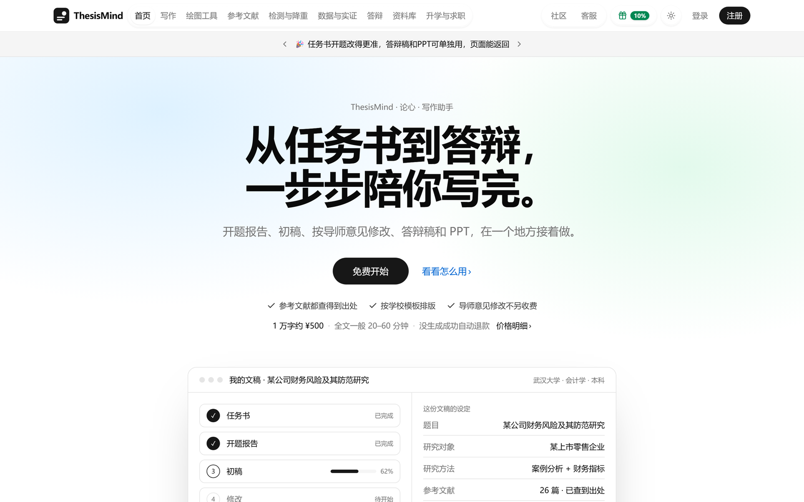
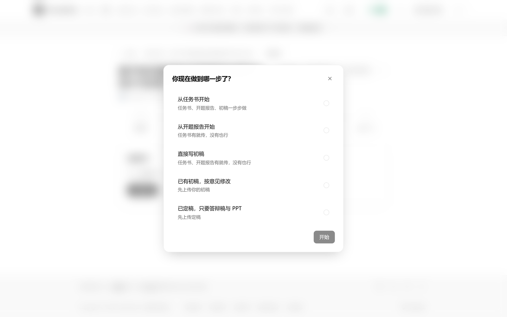
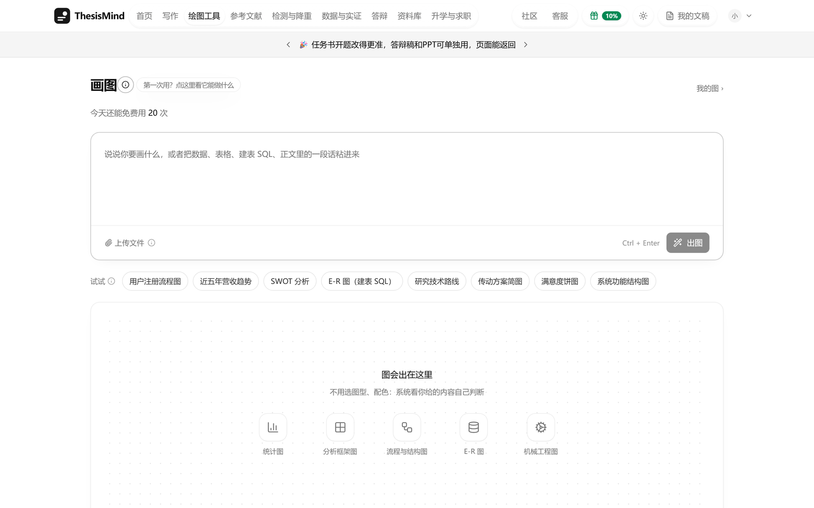
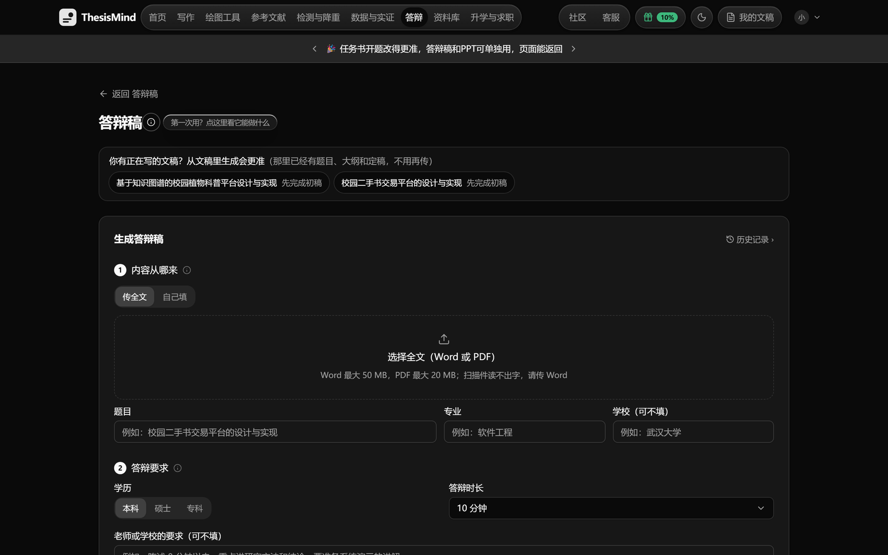
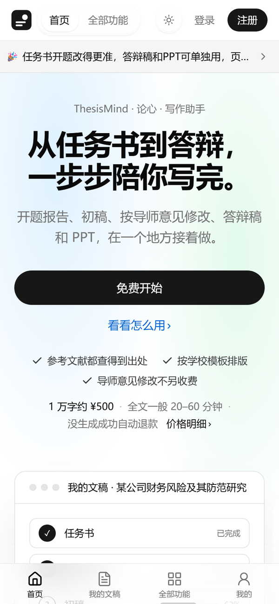
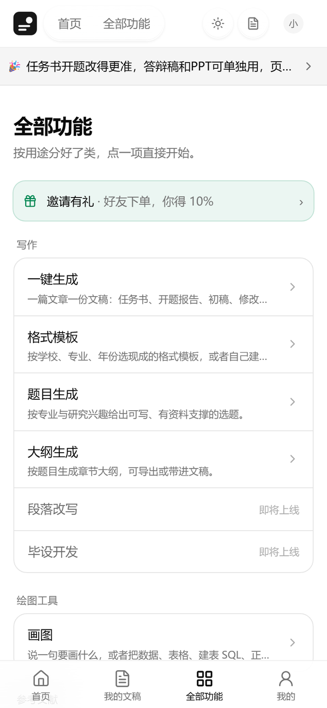

<div align="center">

<a href="https://thesismindai.com"></a>

<h1>ThesisMind Web</h1>

<p><b>从任务书到答辩，一步步陪你写完。</b></p>

<p>ThesisMind · 论心 · 写作助手的网页端。<br />一套构建好的静态页面：放到任何服务器上，用你自己的域名，几分钟开出一个完整的写作站。</p>

<p>
<a href="https://thesismindai.com"><b>官网</b></a> ·
<a href="https://thesismindai.com"><b>在线体验</b></a> ·
<a href="https://thesismindai.com/partner"><b>成为合作伙伴</b></a> ·
<a href="#-三步上线"><b>部署指南</b></a> ·
<a href="#-常见问题"><b>常见问题</b></a> ·
<a href="#-联系我们"><b>联系我们</b></a>
</p>

<p>


</p>

<br />

<picture>
  <source media="(prefers-color-scheme: dark)" srcset="docs/screenshots/home-dark.png" />
  
</picture>

</div>

<br />

## ✨ 它能做什么

<table>
<tr>
<td width="50%" valign="top">

### 📝 一篇论文，一条线写到底
任务书 → 开题报告 → 初稿 → 按导师意见修改 → 答辩稿与答辩 PPT。题目、研究方法、参考文献、学校格式全程同一套，前后对得上。

</td>
<td width="50%" valign="top">

### 📚 参考文献查得到出处
每一条都来自真实数据库、逐条核对。查不到出处的不会写进正文，也不会凑数出现在文末。

</td>
</tr>
<tr>
<td valign="top">

### 🏫 按学校模板排版
字体字号、页边距、页眉页脚、目录样式照学校的来；模板库每套都带校徽，一眼找到自己学校。手上有上一届写好的样例，也能照着它的格式和篇幅写。

</td>
<td valign="top">

### ✍️ 按导师意见修改
带批注的 Word 直接传上来，逐条改到对应位置，没提到的地方不动；没改成的如实说明原因，可以单条重试。

</td>
</tr>
<tr>
<td valign="top">

### 🎤 答辩稿与答辩 PPT
按答辩时长控制篇幅，十个可能被问到的问题附回答要点；PPT 每页先预览，老师给了模板就照模板排。

</td>
<td valign="top">

### 📊 绘图与数据工具
一键画图：说一句话出图，统计图、流程图、E-R 图、SWOT 等分析框架图都行；每类图也有自己的入口（科研统计图、分析框架图、画布绘图、数据库设计、设计类图版、工程与仿真图）。设计类图版（用户旅程、画像卡、KANO、服务蓝图……）照你的调研内容排；工程与仿真图（梁和框架内力图、应力与温度云图、结构平面布置图、PLC 梯形图）按参数真算。还有统计分析、问卷分析和上市公司财报取数。

</td>
</tr>
<tr>
<td valign="top">

### 🌗 深色模式 · 手机适配
深浅色跟着系统走；手机上有底部导航，整站没有横向滚动，随时随地接着写。

</td>
<td valign="top">

### 🔒 页面里没有任何密钥
这里只有客户端页面：不含管理后台，不含任何密钥。名称、logo、主色在后台改，不用重新部署。

</td>
</tr>
</table>

## 📸 看一眼

<table>
<tr>
<td width="50%"></td>
<td width="50%"></td>
</tr>
<tr>
<td align="center"><sub>新建论文：从任务书、开题、初稿，或者从修改、答辩开始都行</sub></td>
<td align="center"><sub>一键画图：说清要画什么，或者把数据、建表语句贴进来</sub></td>
</tr>
<tr>
<td width="50%"></td>
<td width="50%" align="center">
&nbsp;

</td>
</tr>
<tr>
<td align="center"><sub>答辩稿：传全文或者只填题目和要点（深色模式）</sub></td>
<td align="center"><sub>手机上也顺手：底部导航，一屏一件事</sub></td>
</tr>
</table>

## 🚀 三步上线

> [!IMPORTANT]
> 部署前先 **[成为 ThesisMind 合作伙伴](https://thesismindai.com/partner)**，拿到你的合作伙伴编号。在你的域名上注册的客户自动算你的。

**① 登记来源域名**

在合作伙伴后台「开发对接 → 允许的来源域名」填上你要用的地址，例如 `https://www.example.com`。不登记的话浏览器会拦下跨域请求，页面打得开却读不到数据。

**② 上传文件**

把 [`dist/`](dist) 里的所有文件放到网站根目录（例如 `/var/www/web/`），再用后台「开发对接」下载的部署包里那份预填好的 `config.js` 覆盖同名文件。

**③ 配置 nginx**

参考 [`deploy/nginx.conf`](deploy/nginx.conf)。要点只有两条：单页应用回落 `try_files $uri /index.html;`，以及必须走 https。

```nginx
location / { try_files $uri /index.html; }
```

### 🐳 也可以用 Docker

```bash
docker build -t thesismind-web .
docker run -d --name thesismind-web -p 8080:80 \
  -v "$PWD/dist/config.js:/usr/share/nginx/html/config.js:ro" \
  thesismind-web
```

容器只开 80 端口，https 交给前面的反向代理或 CDN。

## ⚙️ 配置

全部配置都在 [`dist/config.js`](dist/config.js)，只有两项、都是公开信息：

| 字段 | 说明 |
| --- | --- |
| `apiBase` | 平台接口地址，在合作伙伴后台下载的部署包里已经填好 |
| `agentCode` | 你的合作伙伴编号，同上 |

> [!CAUTION]
> 永远不要把合作伙伴密钥（`tak_` 开头的那串）写进 `config.js` 或任何页面。这个文件谁都能打开，密钥只能放在你自己的服务端。

## 🎨 换成你自己的品牌

- **名称、logo、主色、客服联系方式、服务条款链接**：在合作伙伴后台「站点 → 品牌」里改，保存后你的网站下次打开就生效，**不用重新部署**。主色会自动调出浅色、深色两套，保证对比度。
- **细调样式**：改 [`dist/custom.css`](dist/custom.css)。它在页面样式之后加载，写在里面的会覆盖默认样式：

  ```css
  :root { --radius: 1rem; }
  ```

- 不要改 `assets/` 里的文件：每次更新都会整个替换。

## 🔄 更新

点右上角 **Watch**，仓库有更新时会通知你。更新时覆盖除 `config.js`、`custom.css` 以外的所有文件即可，客户和数据都在平台上，不受影响。

## ❓ 常见问题

<details>
<summary><b>页面一片空白，或者一直显示“正在打开”？</b></summary>
<br />
多半是来源域名还没登记（第 ① 步），或者网站没走 https。
</details>

<details>
<summary><b>客户注册后不在我的客户列表里？</b></summary>
<br />
确认客户是在你登记过的域名上注册的。在别的地址注册的客户不会算到你名下。
</details>

<details>
<summary><b>画图、预览打不开？</b></summary>
<br />
部分功能要求网站是 https，请确认证书有效、没有混合内容。
</details>

<details>
<summary><b>能放在子目录（比如 example.com/write/）下吗？</b></summary>
<br />
目前请部署在站点根目录，或者单独的子域名（比如 write.example.com）。
</details>

<details>
<summary><b>不想自己维护服务器？</b></summary>
<br />
合作伙伴还可以用 <b>托管分站</b>（平台替你托管，绑定你的域名）或 <b>白标嵌入</b>（一段代码嵌进你现有的网站）。详见 <a href="https://thesismindai.com/partner">成为合作伙伴</a>。
</details>

## 🤝 合作方式

| 方式 | 适合谁 | 你要做的 |
| --- | --- | --- |
| **托管分站** | 想最快开张 | 填好品牌信息，把分站地址发给客户 |
| **白标嵌入** | 已经有网站、有流量 | 把一段代码放进现有页面 |
| **自建前端**（就是这个仓库） | 想完全掌控域名和样式 | 照上面三步部署 |
| **接口对接** | 有自己的产品和开发团队 | 按对接文档调用接口 |

👉 **[了解合作伙伴计划](https://thesismindai.com/partner)**，或者 [扫码加微信](#-联系我们) 直接聊。

<details>
<summary><b>English</b></summary>
<br />

**ThesisMind Web** is the prebuilt web client of ThesisMind, a writing assistant that walks students from the task book and proposal through the first draft, advisor-driven revisions, and the defense script and slides — with every reference traceable to a real source and layout that follows each school's template.

It is a set of static files: drop them on any web server, point your own domain at it, and run a complete writing site. It contains no admin console and no secrets. Partners manage branding (name, logo, colors, support contacts) from the partner console without redeploying.

To deploy, [become a ThesisMind partner](https://thesismindai.com/partner), register your origin domain, upload `dist/`, and serve it over HTTPS with a single-page-app fallback (`try_files $uri /index.html;`). A `Dockerfile` is included.

Questions about the product, partnerships or custom deployments? Scan the WeChat QR code in [Contact](#-联系我们).

</details>

## 💬 联系我们

<div align="center">


<sub><b>微信扫一扫</b>：了解产品、合作伙伴计划、部署与定制，都可以直接聊</sub>

</div>

## 📄 许可与说明

本仓库的文件仅供已登记的 ThesisMind 合作伙伴部署使用，版权所有，保留一切权利，详见 [LICENSE](LICENSE)。

生成的内容仅供学习参考，请遵守所在学校的学术规范。

<div align="center">
<br />
<sub>如果这个项目对你有帮助，点个 ⭐ Star，让更多人看到。</sub>
<br /><br />
<a href="https://thesismindai.com"></a>
<br />
<sub><b>ThesisMind · 论心 · 写作助手</b></sub>
</div>
